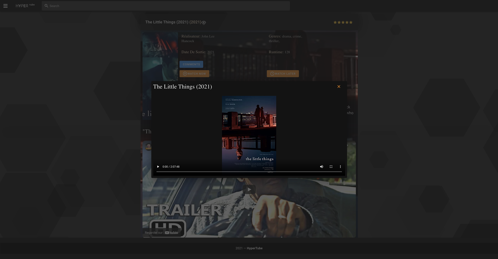
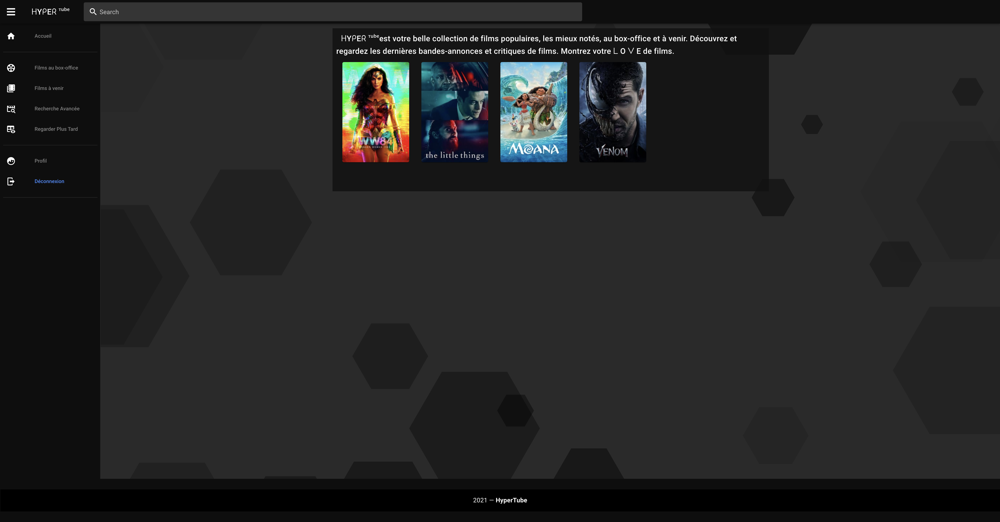

# HYPERTUBE 🍿

Hypertube is a torrent downloading/streaming web app that allows users to research and watch videos with the best UX possible.

## Preview

## Getting Started

These instructions will get you a copy of the project up and running on your local machine

### How to run the project?

1. `npm install` in /API

2. `npm run dev` in /API

3. `npm install && npm run serve` in /client

4. Or `npm install serve -g && serve -s dist` in /client

5. Open browser and go to `http://localhost:8080` or `http://localhost:5000`

6. Enjoy!

#### Defaults

    API: http://localhost:3000

    Client : http://localhost:8080 or http://localhost:5000

## Built With

### Warning

This application is the result of a school project. It's purpose was to teach us about live file streaming and convertion using the bit torrent protocol. It was never meant to run in production and will never be.
